# 主动营销详细说明

> 分类:08-主动营销 | articleId:Tqnc45sPCh | 描述:介绍如何通过平台主动联系客户，包括手动和自动营销的操作流程、设置方法及常见问题解答，帮助企业提升客户互动效率。

主动营销功能让您能够在第一时间与客户建立联系。企业可以手动或自动向客户发送个性化消息，不论是新客户首次访问，还是老客户的回访，您都可以快速采取行动，吸引他们的注意力。
根据不同场景，您可以推送欢迎消息、产品推荐、活动通知等多种类型的信息。通过精心设计的营销内容和策略，帮助您将潜在客户转化为忠实客户。
在ByteTrack平台中，主动营销具体表现为：
1. 手动营销：客服或运营人员通过系统手动选择客户，发送个性化消息。例如向特定客户群体推送新产品发布通知或限时优惠信息。
2. 自动营销：根据预设的触发条件，系统自动向客户发送消息。例如客户首次访问网站时，自动推送欢迎信息。

使用主动营销功能，需要完成下面这几步：👇
1. 套餐升级：请先升级到符合要求的套餐版本。
2. 接入客户洞察：在信使端接入“客户洞察”方法。
3. 自动营销设置（如果需要使用自动营销功能）：完成自动营销的相关配置。
1. 准备工作
## 1.1 升级套餐
自动营销功能需要依赖“客户洞察”作为前置条件。只有当ByteTrack成功洞察客户并在客户列表中形成数据后，您才能主动向客户发起营销。因此：
针对手动营销，您需要升级到 专业版、旗舰版或定制版 才可使用；
针对自动营销，您需要升级到 旗舰版或定制版 才可使用；
请前往 设置→服务订阅→套餐订阅 页面，升级您的套餐👇

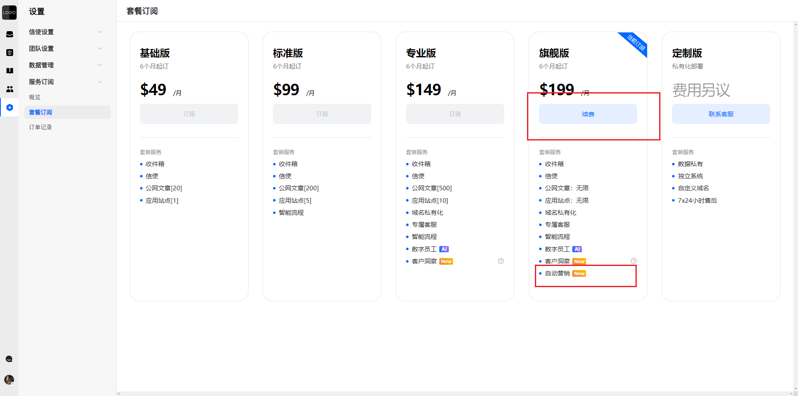

💡 如需升级至定制版套餐，请联系平台客服。
为了确保您能洞察到新的客户，请在 设置→服务订阅→概览 页面中确保您的“客户配额”充足。详见：[客户洞察详细说明](https://docs.bytrack.com/8CTFE8cF/help/wikidetail?articleId=nOvEPqbejq&usageCategoryId=2826&usageGroupId=-1)

## 1.2 信使中接入“客户洞察方法”
ByteTrack目前支持SDK、URL、JS接入。
在接入时，需要使用Insightcode 校验码。您可在 用户管理→洞察设置 页面查询👇
 
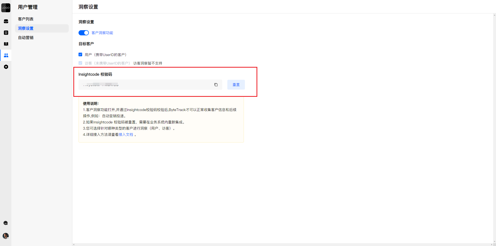
 

客户洞察具体接入方法请参考👇
[Android 接入指南](https://docs.bytrack.com/8CTFE8cF/developers/wikidetail?articleId=rAYwlVm7Ev&usageCategoryId=445&usageGroupId=-1)
[IOS 接入指南](https://docs.bytrack.com/8CTFE8cF/developers/wikidetail?articleId=lV75UrsB5C&usageCategoryId=444)
[Web 接入指南](https://docs.bytrack.com/8CTFE8cF/developers/wikidetail?articleId=dWLrO50NUs&usageCategoryId=443&usageGroupId=-1)
详细使用说明参见：[客户洞察详细说明](https://docs.bytrack.com/8CTFE8cF/help/wikidetail?articleId=nOvEPqbejq&usageCategoryId=2826&usageGroupId=-1)
👏👏👏通过以上步骤，您可以正常使用“手动营销”功能。具体使用方法见下文说明。
若您想使用“自动营销”，还需要进行“自动营销”设置👇

## 1.3 自动营销设置
自动营销支持图文消息。您需要在 用户管理→自动营销 页面配置好需要发送的消息，并打开“自动营销”开关👇

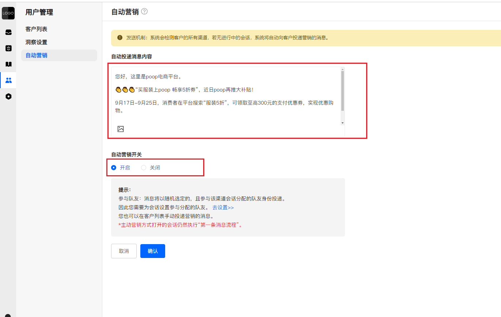

注意：
自动营销优先使用该渠道下在线队友的身份发送消息，其次使用不在线队友的身份。如果没有配置参与分配的队友，自动营销将触发失败。
为了确保自动营销功能的正常运行，您需要为不同的分配模式指定队友：
● 在 设置 → 会话设置 → 普通分配模式 页面，为普通渠道指定参与分配的队友。
● 在 设置 → 会话设置 → 专属分配模式 页面，为专属渠道指定参与分配的队友。

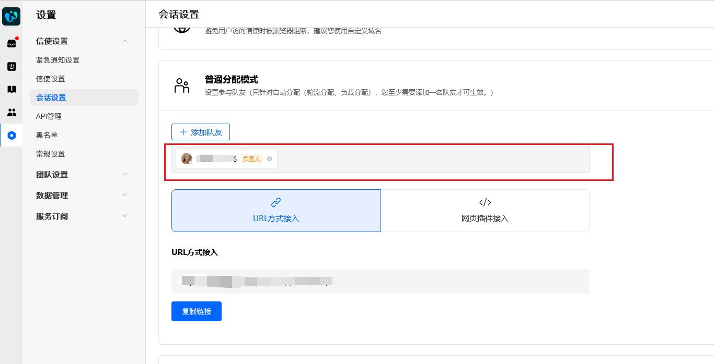

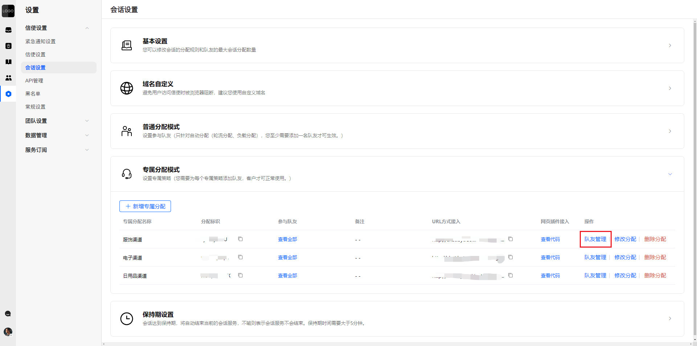

这样，自动营销功能将能够更有效地触达客户，提高营销效果。
2. 使用🎉🎉🎉 恭喜！您已经完成所有主动营销的设置。现在可以与客户建立联系了👇

## 2.1 手动营销
1. 进入 用户管理→客户列表 页面，选择客户的某个渠道，点击详情👇

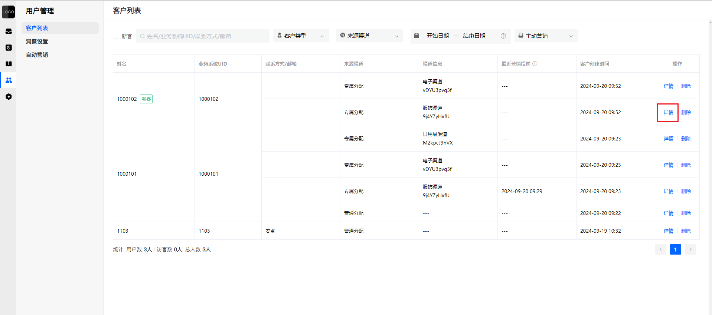

2. 如果有历史沟通记录点击右上角的“回聊”按钮，进入 收件箱，主动发送营销消息以建立沟通👇

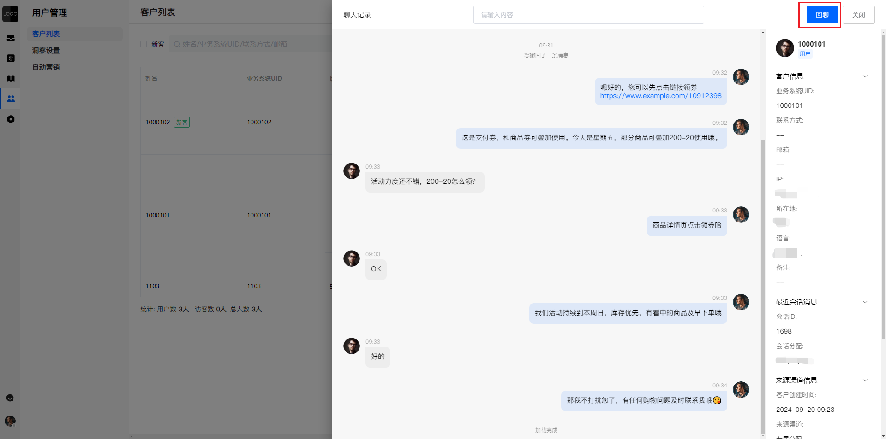

3. 如果没有历史沟通记录在下方的输入框中输入消息并点击“发送”，主动与客户建立联系👇

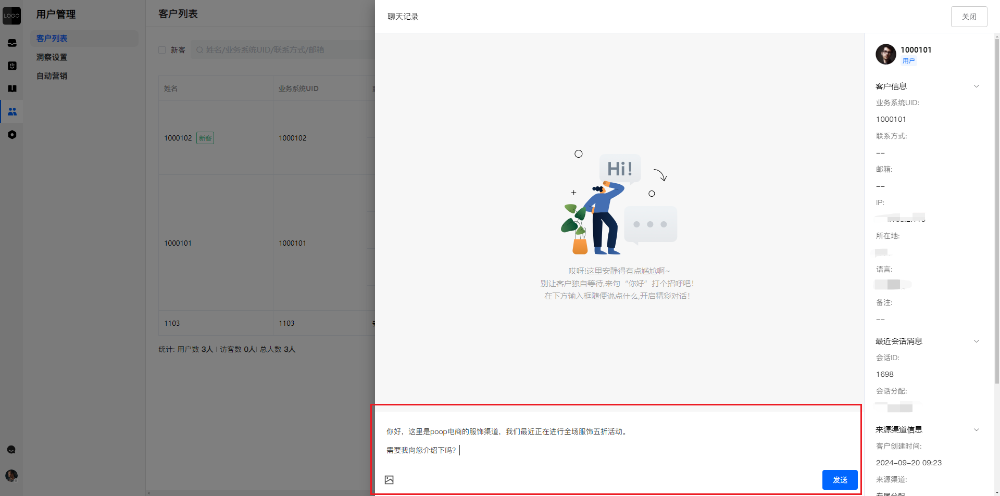

## 2.2 自动营销
自动营销：当信使端调用“客户洞察”方法时，系统会在当前调用渠道下，选择最近一个已结束的会话自动发送营销信息。如果没有已结束的会话，系统将创建一个新会话并自动发送营销信息。信息将以参与分配的队友身份发送👇

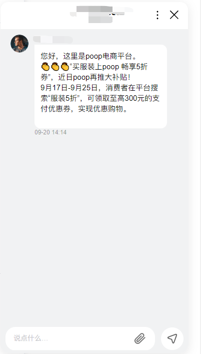

如果客户的信使界面未打开，他们将收到弹框、声效和红点的提醒👇

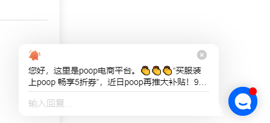

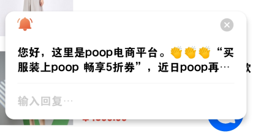

注意：信使侧开启的渠道需与您发送营销消息的渠道一致，客户才能收到您的营销信息。
👋 主动营销创建或重新打开会话时，会正常触发“第一条消息流程”，“新窗口流程”将被中断👇

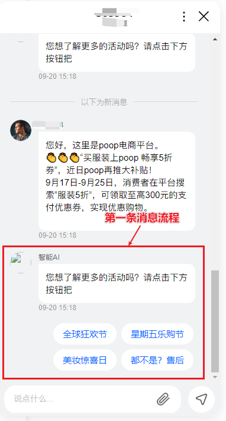

## 2.3 设置信使的弹框、声效、红点

### 2.3.1 弹框设置
在 设置→信使设置→偏好设置 页面，开启“新消息通知”。这样，您的客户每次收到新消息时，都会有弹框通知。
● 如果您不希望客户关闭弹框通知，可将“是否允许手动关闭”选项关闭👇

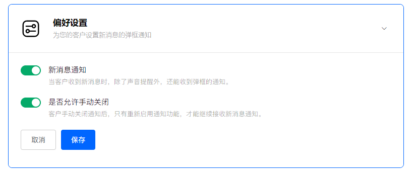

注：如果客户手动关闭了弹框通知，则任何新消息将不再弹出提醒，除非客户手动重新开启弹框通知。
在项目创建时，“新消息通知”、“是否允许手动关闭”均为关闭状态，您可以根据需要手动开启。

### 2.3.2 声效、红点设置
信使端收到新消息时，默认会有声效和红点提醒，无法配置。但请留意以下几个特殊情况：
声效提醒：如果客户手机处于静音状态，则不会收到声效提醒。
红点提醒：
1. 如果信使的角标接入时处于隐藏状态，则收不到红点提醒，会收到声效提醒。
2. 如果信使端关闭了通知，屏蔽通知的图标会遮挡红点提醒，但声效提醒仍会正常触发👇

以上特殊情况可能会影响信使端接收新消息提醒的方式，但不会完全阻止提醒的触发。为确保最佳用户体验，建议在适当的时候提醒客户检查其设备设置。

3. 问答1、为什么我的套餐满足，但是无法洞察客户？
答：请确认以下条件均满足：
1. 请检查 设置→ 服务订阅→ 概览 页面的套餐，是否包括“客户洞察”
2. 请检查 设置→服务订阅→概览 页面的“客户配额”是否充足。如果“客户配额”不足，系统将无法洞察新的渠道客户，也无法发送营销信息。
3. 请检查 客户管理→洞察设置 页面的“客户洞察功能”是否开启，目标洞察客户是否勾选。
4. 请确保“客户洞察校验码”接入正确；
详见：[客户洞察详细说明](https://docs.bytrack.com/8CTFE8cF/help/wikidetail?articleId=nOvEPqbejq&usageCategoryId=2826&usageGroupId=-1)

2、我关闭了“客户洞察”的功能，是否影响已有客户的自动营销？
答：“客户洞察”功能关闭后，仅影响客户新渠道的数据收集，已洞察的客户渠道数据，自动营销将继续正常触发（即客户列表已有的渠道数据会正常触发）。

3、为什么信使端一开始显示了欢迎语，刷新后欢迎语消失？
答：新窗口流程的“欢迎语”仅在没有创建会话或历史会话已结束的情况下显示，当主动营销创建或重新打开会话时，欢迎语不会被记录，因此刷新后欢迎语消失。

4、为什么信使端自动营销发送失败？
答：建议您确保以下是否正常：
 1. 当前渠道下，该客户的所有会话均已结束；
 2. 客户的渠道数据已成功洞察收集（客户列表中存在该渠道记录）；
 3. 您订阅的套餐包含了“自动营销”功能；
 4. “自动营销”的开关已打开；
 5. 该渠道有您的队友参与分配；
 6. 您洞察的渠道，和信使端接入的渠道相同；

5、为什么主动营销发送后，没有正常触发“第一条消息流程”？
答：请确认以下条件均满足：
 1. 智能流程已启用；
 2. 智能流程的触发时间符合要求；
 3. 客户在该渠道下，最近结束的会话语言（可在 收件箱的会话详情页查看），是否包含在智能流程的语言中；
备注：通过主动营销方式创建或重新打开的会话，不会改变该会话的原有语言；只有客户从信使端手动创建或重新打开的会话，才会更新该会话的原有语言。
智能流程的配置，请参见：[智能流程详细说明](https://docs.bytrack.com/8CTFE8cF/help/wikidetail?articleId=dAmklHuZo3&usageCategoryId=870)

🎉🎉🎉现在您已掌握了如何使用主动营销功能，您可以更有效地与客户互动，提高转化率，并建立长期的客户关系。善用这个工具，让您的业务更上一层楼！
想要了解更多？请继续👇
[客户洞察详细说明](https://docs.bytrack.com/8CTFE8cF/help/wikidetail?articleId=nOvEPqbejq&usageCategoryId=2826&usageGroupId=-1)
[Finn的介绍和使用](https://docs.bytrack.com/8CTFE8cF/help/wikidetail?articleId=Z9zntxlTeJ&usageCategoryId=870&usageGroupId=-1)
