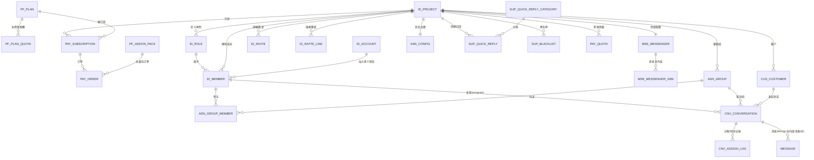

hou g# aitalky V1 领域模型与表结构

> 在写代码/建表前,先理清"系统里有哪些核心对象、它们的关系、业务规则",作为建库与模块划分的地基。
> 参考 ByteTrack(见 `doc/bytrack/`),技术栈见 `技术选型.md`(MySQL 业务 + MongoDB 消息)。
> 范围:V1(会话核心 + 翻译 + 订阅/加密支付),不含 V2(知识库/数字员工/营销)。
> 整理时间:2026-06-08。

---

## 一、角色分层与模块划分

**3 类角色 / 2 套登录**:
- **平台后管(运营方,登录 `pf_admin`)**:管全平台——注册用户、所有租户、订阅、订单、套餐管理、运营统计。
- **租户·坐席(客户方,登录 `id_account`)**:注册→建项目(租户)→团队/坐席→处理会话→买订阅。
- **终端客户(无登录,`external_user_id`)**:经信使聊天。

| 模块(前缀) | 职责 | 核心实体 |
|---|---|---|
| **platform 平台后管 `pf_`** | 平台管理员/角色、套餐管理、对全平台用户/订阅/订单的管理视图 | PfAdmin / PfAdminRole / Plan |
| **identity 身份与租户 `id_`** | 租户账号、项目、成员、角色权限、邀请 | Account / Project / Member / Role / Invite |
| **messenger 信使 `mse_`** | 信使配置(品牌/语言/留存/角标)、多语言内容、接入(URL/userId) | Messenger / MessengerI18n |
| **routing 客服组与分配 `asn_`** | 会话设置(规则/承载量/保持期)、客服组(普通/专属) | Config / Group / GroupMember |
| **customer 客户 `cus_`** | 客户画像、用户/游客双身份、自定义属性 | Customer |
| **conversation 会话 `cnv_`** | 会话生命周期、分配/转派、收件箱列表(内部消息/@在 Mongo) | Conversation / AssignLog |
| **message 消息(Mongo)** | 收发、富消息、已读、撤回、翻译、内部消息/@ | Message |
| **support 辅助 `sup_`** | 快捷回复(+分类)、黑名单 | QuickReply / QuickReplyCategory / Blacklist |
| **billing 订阅计费 `pay_`** | 订阅、资源用量、加密支付订单(套餐在 pf_) | Subscription / Quota / Order |

> 模块间通过接口/领域事件协作,**不互相直接读写对方的表**。

---

## 二、领域模型总览


> 另有平台独立表:`PF_ADMIN`/`PF_ADMIN_ROLE`(平台后管登录)、`PF_AGREEMENT`(协议三件套)。

**一句话串起来**:一个**账号**可加入多个**项目**(租户);项目里有**成员**(坐席),成员有**角色**(决定权限);项目配一套**信使**(客户入口)和**分配规则**;**客户**通过信使发起**会话**,会话按规则**分配**给某个成员、落在某个**客服组**;会话里有很多**消息**(存 Mongo);项目通过**订阅**套餐(加密**支付**)开通使用。

---

## 三、各实体详解

> ⚠️ **表级字段以 `ddl-mysql.sql` 为准(26 表)**。下文为概念说明,已与 DDL 对齐。

### platform 平台后管(`pf_`)
- **PfAdmin / PfAdminRole**:平台运营登录 + 平台 RBAC(管全平台用户/租户/订阅/订单/套餐/协议)。
- **Plan / PlanQuota**:套餐定义 + 套餐含的资源配额(资源类型:席位/翻译字符/客户;通用结构,V2 加资源只加行)。
- **AddonPack**:加量包定义(V1:翻译包 / 席位)。
- **Agreement**:协议三件套(服务条款/隐私政策/套餐订阅协议),多语言,后管编辑。

### identity 身份与租户(`id_`)
- **Account 账号**:租户/坐席侧登录(邮箱+验证码),可加入多个项目。
- **Project 项目(租户)**:数据隔离边界;`app_id`(appId)、`app_secret`(SDK)、`owner_account_id`、`site`(中国站/国际站)、`is_private`(专有云)。
- **Role 角色**:预置 负责人/管理员/普通用户(名/权限不可改);`permissions`={pages 页面权限, functions 功能权限}(含收件箱"全部/未分配"视图)。
- **Member 成员(坐席)**:account×project;昵称(单一真相)/头像/状态/在线/工作状态 + 个人偏好(语言/音效/推送)。
- **Invite / InviteLink**:邮箱邀请(一邮箱一条) / 链接邀请(可复用、记加入人数、可禁用、72h)。

### messenger 信使(`mse_`)
- **Messenger**:品牌(brand_name/logo)、网站标题+图标(web_title/web_icon)、自定义域名、**启动器角标样式**(launcher_config)、默认语言、启用语种、回复时间、消息留存、弹窗偏好(红点/声效恒开)。
- **MessengerI18n**:按语言的 问候语/团队介绍/紧急通知(+开关)。
- 接入 URL 见第九节。

### routing 客服组与分配(`asn_`)
- **Config 会话设置**:分配规则(手动/轮流/负载)、承载量(capacity_limit)、保持期(自动结束 idle 分钟)。
- **Group 客服组**:普通(共享队列)/ 专属(各有 `group_key`=URL 的 groupId);**GroupMember**=组内参与分配的队友。

### customer 客户(`cus_`)
- **Customer**:`external_user_id`(用户态聚合键,复杂无序) / `visitor_id`(游客设备态);名称头像(系统随机生成)、源语言、自定义属性(钱包/链/交易号);IP/所在地记在会话上。

### conversation 会话(`cnv_`)
- **Conversation**:状态 0等待队列/1进行中/2已结束;`assignee_member_id`(空=未分配);来源/设备/IP/所在地;自动翻译开关;`last_seq`;**收件箱列表数据源(MySQL),不扫 Mongo**。
- **AssignLog**:分配/转派记录。
- 内部消息/@提及:**不单独建表**,作为 Mongo 消息(`internal=true`+`mentions[]`)。

### message 消息(MongoDB)
- 会话内每条消息:文本/图文/附件/卡片、翻译缓存、`seq`、已读/撤回、`internal`/`mentions`。详见第五、六节。

### support 辅助(`sup_`)
- **QuickReply / QuickReplyCategory**:快捷回复 + 可管理分类(售前/售后/未分类)+ 排序;`title`话术简称、`content`话术内容。
- **Blacklist**:按 用户(业务UID,全设备生效) / 设备(游客 visitor_id) 拉黑。

### billing 计费(`pay_` + 套餐在 `pf_`)
- **Subscription 订阅**:项目级,套餐/状态/起止(开通次日起算);未订阅或过期 → 限制使用。
- **Quota 资源用量**:项目×资源(total/used);套餐给基础量 + 加量包累加;席位/文章等 used 动态算。
- **Order 支付订单**:数字货币在线(USDT,TRC20/ERC20,搬 cicada/NexaPay);类型=套餐订阅/续费/升级/购席位/购加量包;含 充值地址/交易号/24h超时;到账回调激活。

---

## 四、关键业务规则

1. **租户隔离**:所有业务查询强制带 `project_id`(MyBatis 拦截器全局注入),杜绝跨项目串数据。
2. **权限可见性**:成员能看哪些模块由 `role.permissions` 决定;会话可见性 = 角色 + 分配(只有"负责人/管理员"类角色能看全部会话,客服只看分给自己的)。**用 RBAC + 分配实现,而不是 cicada 的"代看"补丁**。
3. **客户身份聚合**:同一 `(project_id, external_user_id)` 的访问聚合为同一 Customer,其所有会话归集到一起;`external_user_id` 要求复杂无序防猜测。
4. **会话分配**:新会话按 `AssignmentConfig.mode` 分配——
   - manual:进未分配池,人工认领;
   - round_robin:在组内在线坐席间轮流;
   - load:分给"在线 + 进行中会话最少"的坐席;
   - 受 `capacity_limit` 约束:达上限的坐席不参与自动分配。
5. **会话生命周期**:open → closed;closed 不计入承载量;可重开(客户再发消息)。
6. **转派**:改 `assignee_member_id`,记 `cnv_assign_log`(分配/转派记录)。
7. **单一真相**:成员当前昵称/头像只存 `id_member`(管理端改它);消息体只存 Mongo——业务"当前态"字段不跨表重复(避开 cicada 不一致 bug)。**例外见规则 9**:消息里的 `senderName/senderAvatar` 是**发送时快照**(历史态),与"当前态"是不同语义,刻意冗余。
8. **收件箱列表走 MySQL**:新消息到达时更新 Conversation 的 `last_message_*`/`unread_count`;列表查询只读 MySQL,打开会话才去 Mongo 拉明细。
9. **发送者真实身份 + 快照**(直击 cicada 代发显示错):每条消息存**真实** `senderType+senderId`(负责人代发就是负责人 id,不伪装成账号坐席),并**快照** `senderName/senderAvatar`。
   - 信使端/坐席端按消息自带身份渲染 → **负责人回显示负责人、成员回显示成员,各显其名**。
   - 快照 = 发送时刻定格,**改成员头像/昵称不回溯历史消息**(新消息用新值,旧消息保留旧值,与 ByteTrack 一致;也保证成员被删后历史仍可渲染)。
10. **成员资料由管理端维护(权限)**:普通成员**不能自助改昵称/头像**;由有「成员管理」功能权限的负责人/管理员在 `成员管理` 中 **重命名/修改头像/禁用/删除/调整角色**。普通成员「个人中心」只可改偏好(`language/sound_enabled/push_enabled`)。→ `id_role.permissions.functions` 须含「成员管理」。

---

## 五、消息顺序与可靠投递(核心,直击 cicada 痛点)

> 解决两类线上问题:① **顺序错乱**(同会话消息乱序) ② **WS 漏推/丢消息**。
> 原则:**先落库,再推送;库是真相,WS 只是实时优化**——推没推到只影响"实不实时",不影响"丢不丢"。
> 注意区分:cicada 这周修的"串窗口"是**路由问题**(单点登录推错窗口),已被本设计的"按 conversationId 路由 + 分配模型"消除;本节解决的是**顺序**与**漏推**。

### 5.1 顺序保证(防乱序)
1. **会话内单调序号 `seq`**:消息入口按 `conversationId` 分配单调递增序号(Redis `INCR` 或库序列)——**一切以 seq 为准**(显示/同步/缺口检测都用它)。
2. **传输保序**:RocketMQ **顺序消息**,以 `conversationId` 为 key → 同会话进同分区、单线程顺序消费。
3. **客户端排序**:端上**一律按 seq 排序后渲染**,即使网络让某条晚到也插到正确位置。

### 5.2 可靠投递(防丢 + 补推)
1. **先落库再推**:消息先持久化(MySQL 会话维护 `conversation` + Mongo `messages`),**然后才** WS 推送 → 推失败/离线/断线也不丢。
2. **上线/重连同步(核心补推)**:客户端记录已收 `seq` 水位;**(重)连接时上报水位 → 服务端返回该 seq 之后的所有消息** → 一次性补齐任何漏推。**这是 cicada 缺失、本系统必做的一环**。
3. **ACK + 重传**:每条推送客户端回 ACK(带 seq);服务端对超时未 ACK 的**重传 N 次**(覆盖"推了但没到")。
4. **缺口检测**:seq 单调,客户端发现跳号(收到 N+2 缺 N+1)→ 主动拉缺口。
5. **心跳 + 自动重连**:WS 心跳探活,断线自动重连 → 触发第 2 条同步。
6. **去重**:补推/重传难免重复,客户端按 `msgId/seq` 去重。

> 合计 = **at-least-once 投递 + 客户端去重 → 不丢、不乱、不重**。

### 5.3 涉及的接口/字段
- 消息增加 `seq`(会话内单调,见第五·下节 Mongo 结构补充)。
- 同步接口:`GET /messages/sync?conversationId={}&afterSeq={}` → 返回缺失消息。
- WS 协议增加 **ACK 帧**(客户端确认收到 seq)。
- 客户端持久化"每会话已收 seq 水位",连接握手后自动同步。

---

## 六、存储设计

### 6.1 MySQL 表(26 张 —— 以 `ddl-mysql.sql` 为权威)

> ✅ **完整可执行 DDL 见同目录 `ddl-mysql.sql`**;每表含 `create_by/create_time/update_by/update_time/del_flag`,雪花ID 主键,租户表带 `project_id`。

| 前缀 | 模块 | 表 |
|---|---|---|
| `pf_` | 平台后管 | admin / admin_role / plan / plan_quota / addon_pack / agreement |
| `id_` | 身份租户 | account / project / role / member / invite / invite_link |
| `mse_` | 信使 | messenger / messenger_i18n |
| `asn_` | 客服组与分配 | config / group / group_member |
| `cus_` | 客户 | customer |
| `cnv_` | 会话 | conversation / assign_log |
| `sup_` | 辅助 | quick_reply / quick_reply_category / blacklist |
| `pay_` | 计费 | subscription / quota / order |
> 消息体在 MongoDB(见 6.2);内部消息/@提及 也在 Mongo(`internal`+`mentions`)。

### 6.2 MongoDB 消息集合

```js
// 集合: messages   (按 conversationId 读, 按 projectId+conversationId 分片)
{
  _id:           ObjectId,
  msgId:         "雪花ID",          // 业务消息ID(去重/撤回用)
  seq:           1024,              // 会话内单调序号(排序/同步水位/缺口检测)
  projectId:     12345,
  conversationId:67890,
  customerId:    111,
  senderType:    "customer|agent|system",
  senderId:      222,               // agent=memberId(真实发送者,负责人代发=负责人id), customer=customerId
  senderName:    "Sally wang",      // 发送者昵称【发送时快照】信使端按此渲染→负责人/成员各显其名
  senderAvatar:  "https://.../a.png",// 发送者头像【发送时快照】改头像不回溯历史(与ByteTrack一致)
  type:          "text|image|file|card",
  content:       "...",             // 文本; 富消息放 payload
  payload:       { },               // 图片/文件/卡片结构化内容
  translations:  { "en":"...", "zh":"..." },
  isRead:        false,
  isVisible:     true,              // 撤回置 false
  internal:      false,             // true=内部消息/备注(客户不可见)
  mentions:      [333,444],         // 内部消息 @提及的成员id(驱动"提及我的"视图)
  timestamp:     1780000000000
}
// 索引: { conversationId:1, seq:1 }  (按会话顺序读 + 同步 afterSeq)
// 分片键: { projectId:1, conversationId:1 }  (规模大时启用)
```

---

## 七、通用约定

- **主键**:雪花ID(BIGINT),不用自增(分布式/分库友好)。
- **租户**:所有业务表带 `project_id`,拦截器全局强制过滤。
- **审计字段**:`created_at` / `updated_at`(必备),需要时加 `created_by` / `updated_by` / `deleted`(逻辑删除)。
- **命名**:表名/字段 snake_case;布尔用 TINYINT/状态枚举;时间 DATETIME(UTC)。
- **金额**:法币 DECIMAL;加密货币金额用高精度 DECIMAL/字符串,**禁用 float/double**。
- **敏感数据**:密码 hash;支付密钥/地址等不打日志(沿用全局安全规范)。
- **配置**:库名/host/密钥全走环境变量,**杜绝 cicada 式硬编码**。

---

## 八、与参考/旧系统的对应

| aitalky | ByteTrack | cicada(旧) |
|---|---|---|
| Project | 项目 | 租户(tenant) |
| Member + Role(RBAC) | 成员 + 角色权限 | 坐席账号 + 负责人/成员(粗糙) |
| Conversation + assignee | 会话 + 分配 | 客户直连账号(无分配) |
| AgentGroup(普通/专属) | 普通/专属客服组 | 弱 |
| Customer.external_user_id | userId 聚合 | customerId |
| Message(Mongo) | 消息 | Mongo 消息(字段散乱) |
| Subscription + Quota + Order | 服务订阅 | 套餐(pf_plan) + NexaPay 加密支付(复用) |

---

## 九、下一步
- 评审本领域模型 → 补全剩余表 DDL → **模块划分映射到工程目录骨架** → 搭后端骨架(多租户/鉴权/RBAC 地基)+ 前端 monorepo 骨架。

---

## 十、接入与会话设置(白话说明 + 字段对应)

> 给团队理解用。"客服组"不是独立菜单,在 **设置→信使设置→会话设置** 页面内。

### 10.1 信使接入 URL 模型
```
https://{信使域名}/?appId={项目appId}&groupId={客服组key}&userId={业务UID}&lang=zh_CN&redirectUrl=...
```
| 参数 | 来源 | 作用 | 必填 |
|---|---|---|---|
| `appId` | `id_project.app_id` | 定位项目/租户 | 是 |
| `groupId` | `asn_group.group_key` | 路由到专属客服组;不带=普通共享队列 | 否(专属才带) |
| `userId` | 业务系统 | 按它聚合该用户全部会话(复杂无序防猜测) | 否 |
| `lang` | 业务系统 | 信使语言(16 种) | 否(默认语言兜底) |
| `redirectUrl` | 业务系统 | 关闭信使后回跳页(带则有"关闭"按钮) | 否 |

接入方式:**URL 直链** / **网页插件(JS)** / SDK(后置)。客户端 im-h5 从 URL 取参 → 连 WS 登录 → 后端按 appId 定位项目、groupId 选组、userId/visitor_id 聚合客户 → 创建/找到会话。

### 10.2 会话设置页(各块 → 字段对应)
| 块 | 白话 | 表/字段 |
|---|---|---|
| 基本设置 | 选分配规则 + 每坐席最大同时会话数 | `asn_config.mode`(1手动/2轮流/3负载) + `capacity_limit` |
| 域名自定义 | 信使自定义域名 | `mse_messenger.custom_domain` |
| 普通分配模式 | 一个共享队列;加"参与自动分配的队友";给一个 `?appId=` 接入URL | `asn_group`(type=1普通,默认一条) + `asn_group_member` |
| 专属分配模式 | 多个业务线客服组,各有 groupId+URL+队友;不同入口客户分到不同组 | `asn_group`(type=2专属,各有 `group_key`) + `asn_group_member` |
| 保持期设置 | 会话空闲达 N 分钟(≥5)自动结束;可开关 | `asn_config.auto_close_idle_minutes`(0=不自动) |

### 10.3 普通 vs 专属(什么时候用哪个)
- **普通分配模式**:只有一个客服入口,所有客户进同一队列,参与的坐席按规则(轮流/负载)接。简单场景用这个。
- **专属分配模式**:有多个客服入口/业务线(如 售前、售后、不同产品线),每个入口一个 groupId,客户从哪个入口进就分给对应组的坐席。

### 10.4 API管理
技术接入信使需要 `appId`(和专属组 `groupId`、SDK 用 `app_secret`)。API管理页面 = 展示 `id_project.app_id`/`app_secret` + 各组接入 URL + 文档链接。**不需要独立表**(读现有字段)。开放给租户调用的 REST API(API key 体系)= V2,不在 V1。
